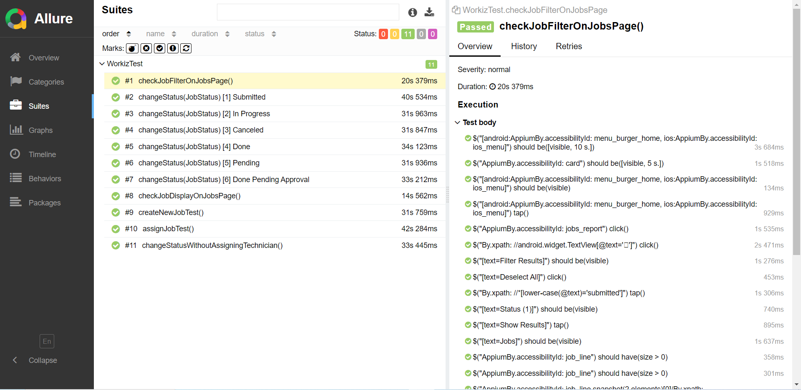
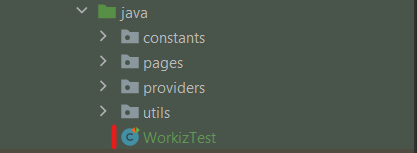
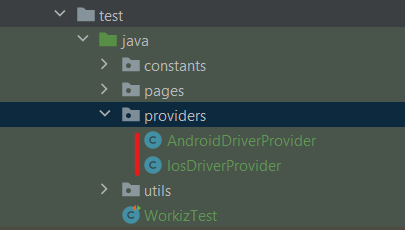
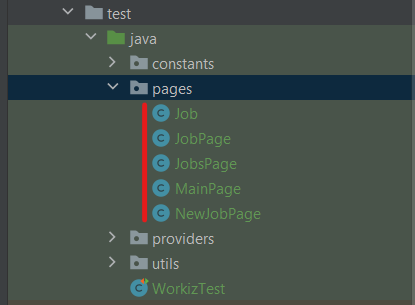

# Selenide-appium mobile tests example for [Workiz app](https://play.google.com/store/apps/details?id=com.workiz&hl=en&pli=1)

Project contains examples of using [Selenide-appium](https://selenide.org/) to create simple and concise tests using Page Object Model for Workiz Android App version 3.371. 

#### To run tests and generate Allure report:

* Make sure you have appium server running (On default host and port - `127.0.0.1:4723`)
* Your Emulator/Real Device is opened/connected. To check you can run `adb devices -l` in your Terminal from `%ANDROID_HOME%/platform-tools`. If your device appears in the list it means you can run tests on it.
    
>[!NOTE]    
>Now tests are configured to run on my personal mobile device where Workiz app is already installed. To reconfigure that you should add your device/app capabilities to `AndroidDriverProvider`. You can find info about needed capabilities in [Appium docs](https://appium.io/docs/en/2.2/guides/caps/).


* Run `mvn clean test`

* To automatically open Allure report run `mvn allure:serve` after tests completion. It should look like this:



### Project structure

#### First we have our main test class `WorkizTest`.



It has a `@BeforeAll setUp()` where appium Mobile driver is created, `@BeforeEach luanchApp()` where the app is launched or activated, tests and `@AfterEach closeApp()` which closes app after each test.

#### Then we have `providers` folder containing `DriverProvider` classes.



You can add your own driver provider, for example for BrowserStack or LambdaTest. Then you can just pass your driver provider's class name to selenide in code - `Configuration.browser = YourProvider.class.getName();` or in `selenide.properties` - `selenide.browser = providers.YourProvider` or even as a maven argument - `mvn clean test -Dselenide.browser = providers.YourProvider`

#### We also have `pages` folder which contains Page Objects. 



I didn't use PageFactory because with Selenide you can just define Selenide elements on the page and everything will be fine because of [Lazy Loading](https://github.com/selenide/selenide/wiki/lazy-loading)! Thought I had to do a custom solution in `Helper` to add widget support such as `Job`.

### What can be improved

Tests are written only for Android, because I don't own a Mac, I could've used BrowserStack or LambdaTest but their free accounts don't allow App Automation.
Despite that tests are made with possibility of iOS tests in mind. To implement tests for iOS App you should just add needed capabilities to `IosDriverProvider`, add iOS selectors to all pages using Selenide `CombinedBy` like here:
```java
    SelenideAppiumElement menu = $(CombinedBy.android(accessibilityId("menu_burger_home"))
        .ios(accessibilityId("ios_menu")));
```
And if business logic of iOS app is the same as in Android app - you can just run tests specifying the platform:
`mvn clean -Dplatform=ios test`


